<div align="center">
  
  <br><br>
  <h1>THE GRILL HOUSE RESTAURANT</h1>
  <p><strong>Sistema de gesti&oacute;n integral para restaurantes</strong></p>
  <p>Administraci&oacute;n completa de restaurante con m&oacute;dulos de empleados, clientes, platos, pedidos, pagos y reportes</p>
  <p>The Grill House Restaurant System es una aplicaci&oacute;n web desarrollada con Spring Boot que permite gestionar un restaurante de forma integral. Administra empleados, clientes y platos del men&uacute;; gestiona pedidos con asignaci&oacute;n de mesas y seguimiento de estado; registra pagos con generaci&oacute;n de tickets en PDF para impresora térmica de 80mm; exporta reportes y monitorea el sistema en tiempo real. Incluye autenticaci&oacute;n por roles (administrador, mesero, cocinero, cajero) y conexi&oacute;n a base de datos MySQL.</p>

  
  
  
  
  
  
  
  
  
  
  
  
  
</div>

## Tabla de Contenidos

- [Descripción](#descripción)
- [Capturas del Sistema](#capturas-del-sistema)
- [Características](#características)
- [Requisitos Previos](#requisitos-previos)
- [Instalación y Ejecución](#instalación-y-ejecución)
- [Estructura del Proyecto](#estructura-del-proyecto)
## Descripción

**The Grill House Restaurant System** es una aplicación web full-stack diseñada para la gestión integral de restaurantes. Proporciona herramientas para administrar empleados, clientes, menú de platos, pedidos, pagos y generación de tickets, todo con una interfaz moderna y responsive.

### Módulos principales:

- **Dashboard** — Estadísticas en tiempo real con gráficos de ingresos mensuales y platos más vendidos.
- **Empleados** — CRUD completo con roles: Administrador, Mesero, Cocinero, Cajero.
- **Clientes** — CRUD con búsqueda autocompletada para asignación rápida en pedidos.
- **Platos** — CRUD del menú con carga de imágenes, disponibilidad y vista tipo tarjeta.
- **Pedidos** — Creación de pedidos seleccionando cliente, platos con cantidades y mesa. Seguimiento de estado: *Completado* / *En Proceso*.
- **Pagos** — Registro de pagos con múltiples métodos: Efectivo, Tarjeta, Yape, Plin. Generación de ticket PDF para impresora térmica de 80mm.
- **Monitoreo** — Página de monitoreo del sistema con uso de memoria, CPU y disco. Alertas automáticas cuando se superan umbrales críticos.
## Capturas del Sistema

A continuación se muestran las principales interfaces del sistema:

### Pantalla de Inicio de Sesión

<div align="center">
  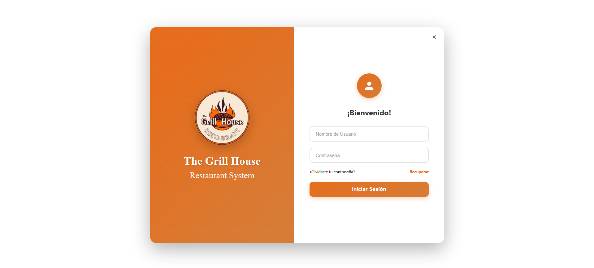
</div>

Formulario de autenticación con credenciales por rol (administrador, mesero, cocinero, cajero).

### Dashboard Principal

<div align="center">
  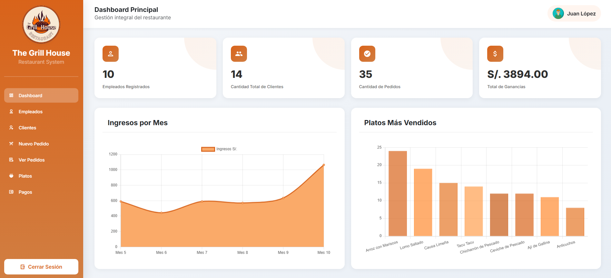
</div>

Panel de control con estadísticas en tiempo real: conteo de empleados, clientes, pedidos e ingresos totales. Incluye gráficos de tendencia de ingresos mensuales y platos más vendidos.

### Gestión de Empleados

<div align="center">
  <table>
    <tr>
      <td>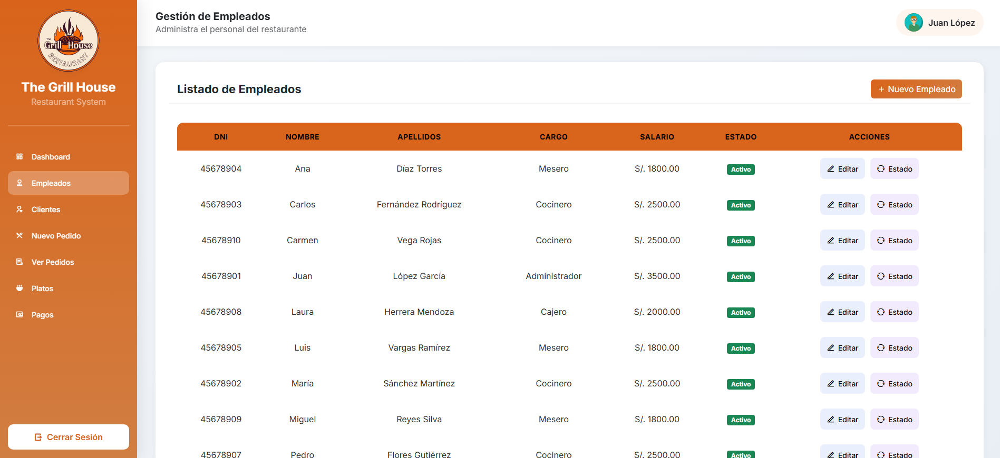</td>
      <td>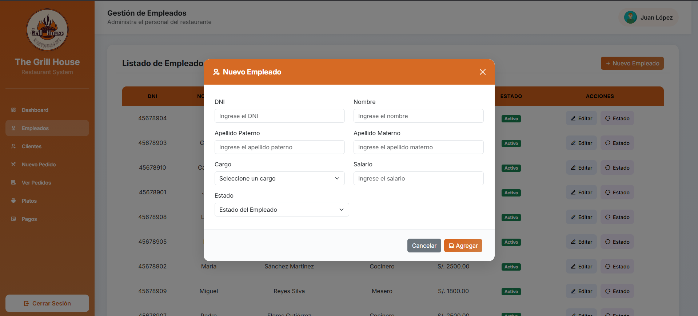</td>
    </tr>
    <tr>
      <td><em>Listado de empleados con opciones de edición y eliminación.</em></td>
      <td><em>Formulario para registrar un nuevo empleado con selección de rol.</em></td>
    </tr>
  </table>
</div>

### Gestión de Clientes

<div align="center">
  <table>
    <tr>
      <td>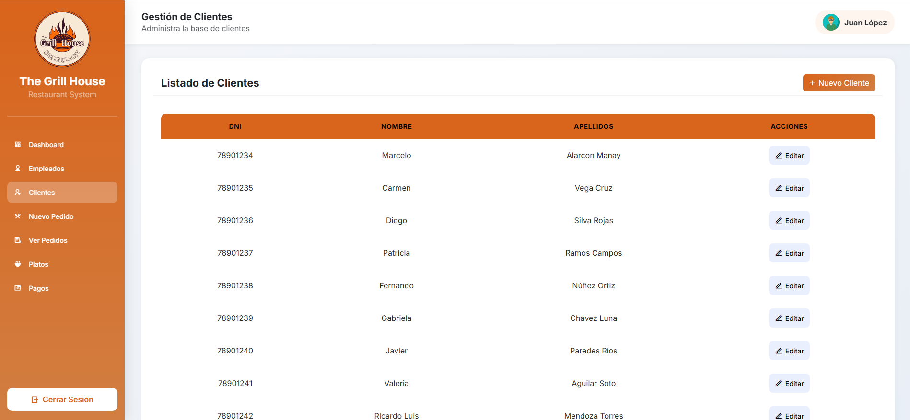</td>
      <td>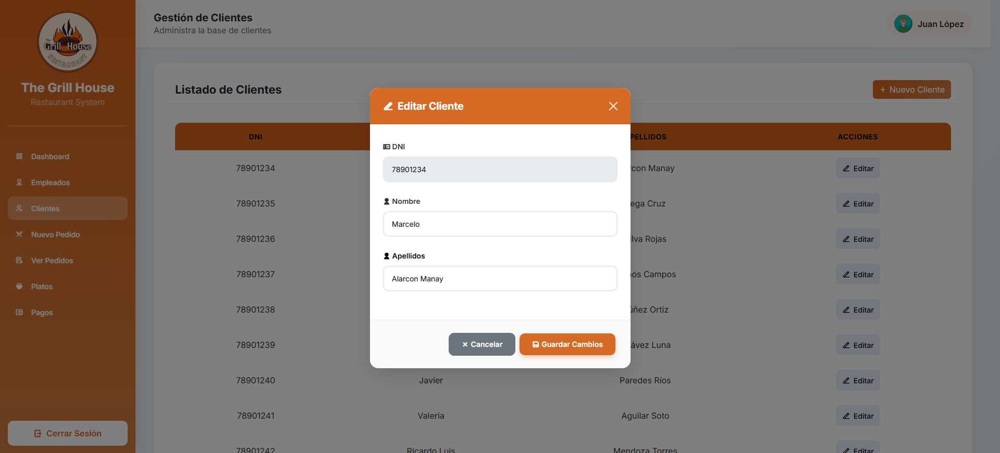</td>
    </tr>
    <tr>
      <td><em>Listado de clientes registrados con búsqueda autocompletada.</em></td>
      <td><em>Formulario de edición de datos del cliente.</em></td>
    </tr>
  </table>
</div>

### Gestión de Pedidos

<div align="center">
  <table>
    <tr>
      <td>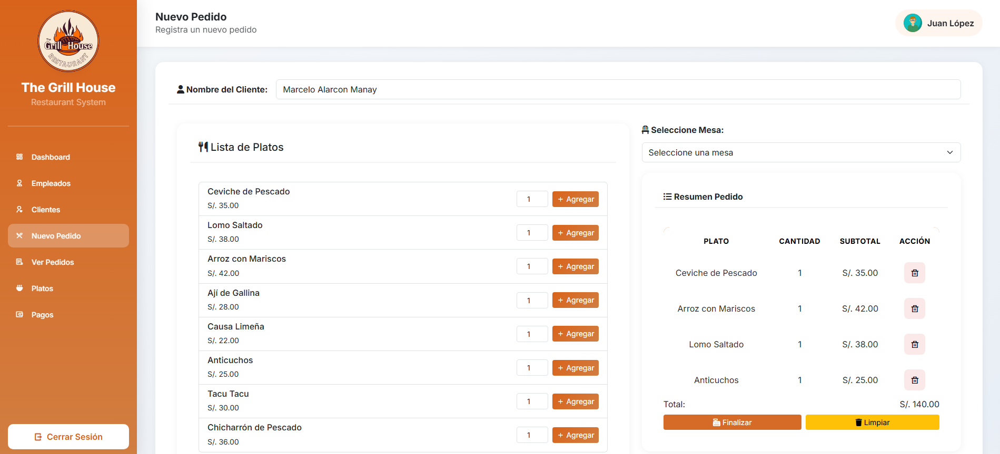</td>
      <td>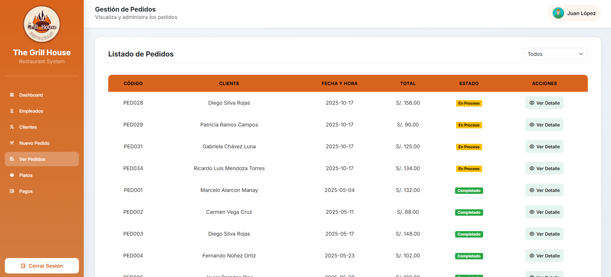</td>
    </tr>
    <tr>
      <td><em>Creación de pedido con selección de cliente y platos.</em></td>
      <td><em>Lista de pedidos con seguimiento de estado (Completado / En Proceso).</em></td>
    </tr>
    <tr>
      <td colspan="2" align="center">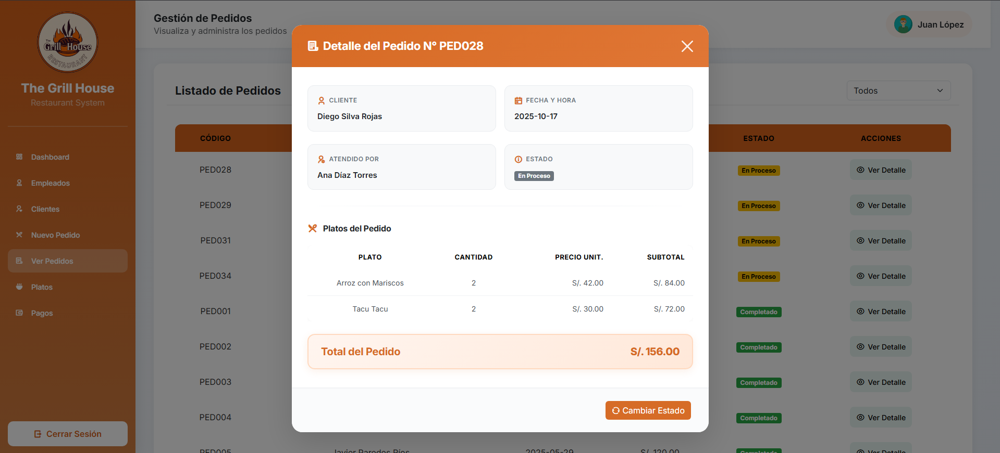</td>
    </tr>
    <tr>
      <td colspan="2" align="center"><em>Vista detallada del pedido con platos, cantidades y total.</em></td>
    </tr>
  </table>
</div>

### Gestión del Menú

<div align="center">
  <table>
    <tr>
      <td>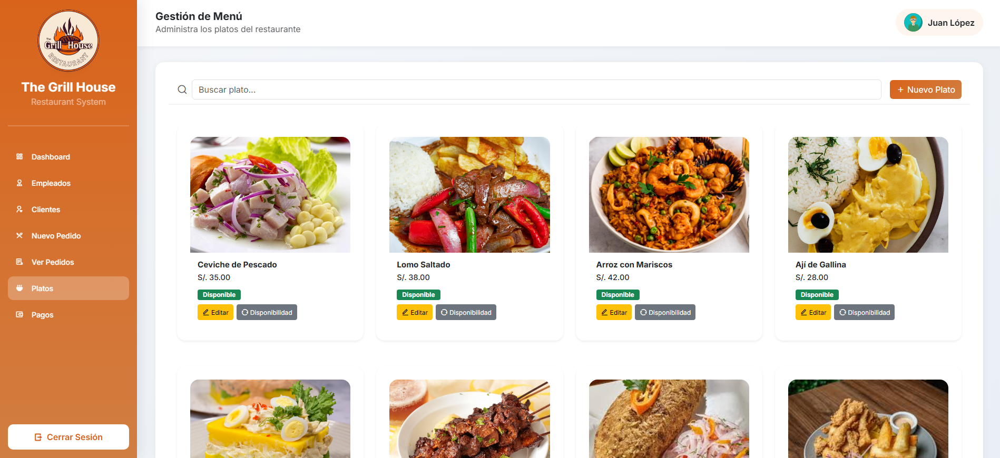</td>
      <td>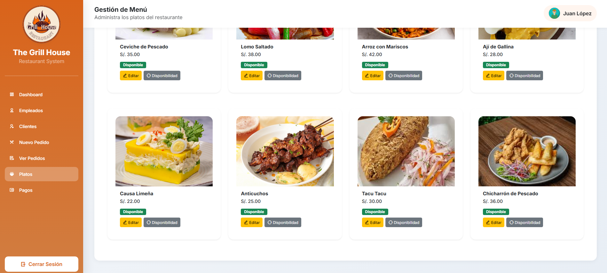</td>
    </tr>
    <tr>
      <td><em>Vista general del menú con platos disponibles.</em></td>
      <td><em>Vista tipo tarjeta con imágenes y estado de disponibilidad.</em></td>
    </tr>
    <tr>
      <td colspan="2" align="center">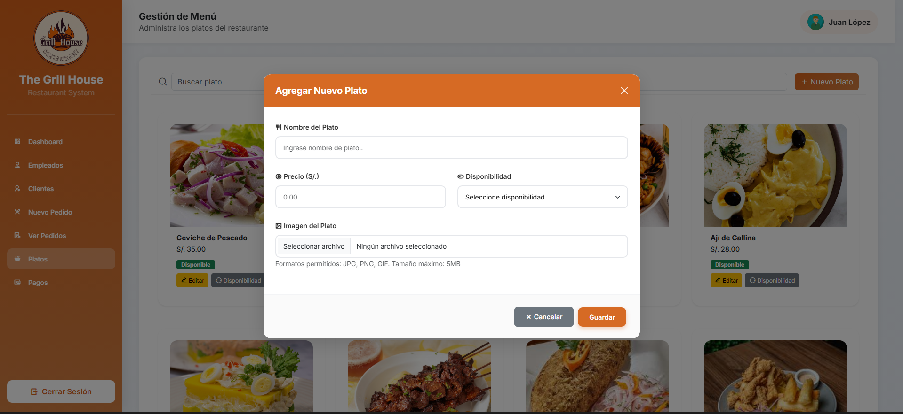</td>
    </tr>
    <tr>
      <td colspan="2" align="center"><em>Formulario para agregar un nuevo plato al menú con imagen.</em></td>
    </tr>
  </table>
</div>

### Gestión de Pagos

<div align="center">
  <table>
    <tr>
      <td>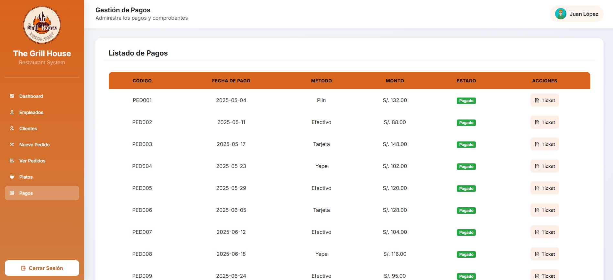</td>
      <td>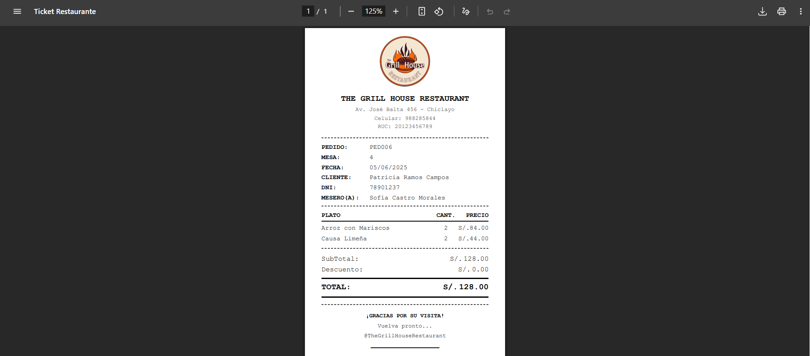</td>
    </tr>
    <tr>
      <td><em>Registro de pagos con selección de método (Efectivo, Tarjeta, Yape, Plin).</em></td>
      <td><em>Ticket PDF generado automáticamente para impresora térmica de 80mm.</em></td>
    </tr>
  </table>
</div>

## Características

- **Autenticación por roles** — Acceso diferenciado para administrador, mesero, cocinero y cajero.
- **Dashboard interactivo** — Estadísticas en tiempo real con gráficos de ingresos y platos más vendidos.
- **CRUD completo** — Empleados, clientes y platos con validación y búsqueda.
- **Pedidos con estado** — Seguimiento de pedidos: completado / en proceso.
- **Múltiples métodos de pago** — Efectivo, Tarjeta, Yape, Plin.
- **Ticket PDF térmico** — Generación de tickets formateados para impresora de 80mm mediante microservicio Node.js + Puppeteer.
- **Monitoreo del sistema** — Página y servicio programado que registra memoria, CPU y disco con alertas.
- **Backup automático de base de datos** — Tarea programada para respaldos.
- **Exportación de métricas** — Integración con Prometheus para monitoreo avanzado.
- **Responsive Design** — Interfaz adaptable gracias a Bootstrap 5.
- **Notificaciones por correo** — Alertas del sistema vía Spring Mail.

## Requisitos Previos

| Herramienta | Versión Mínima |
|---|---|
| Java JDK | 21+ |
| Maven | 3.8+ |
| MySQL | 8.0+ |
| Node.js | 18+ (para el microservicio de tickets) |
| npm | 9+ |

## Instalación y Ejecución

### 1. Clonar el repositorio

```bash
git clone https://github.com/tu-usuario/SystemRestaurant.git
cd SystemRestaurant
```

### 2. Configurar la base de datos MySQL

Ejecutar el script SQL incluido:

```bash
mysql -u root -p < ScriptRestaurante.sql
```

### 3. Configurar `application.properties`

Editar el archivo `src/main/resources/application.properties` con tus credenciales de MySQL:

```properties
spring.datasource.url=jdbc:mysql://localhost:3306/restauranteDB
spring.datasource.username=root
spring.datasource.password=tu_contraseña
```

### 4. Construir y ejecutar la aplicación

```bash
./mvnw spring-boot:run
```

La aplicación estará disponible en: `http://localhost:8080`

### 5. Iniciar el microservicio de tickets (opcional)

Para la generación de tickets PDF:

```bash
cd serverNode
npm install
npm start
```

El microservicio estará disponible en: `http://localhost:3000`

## Estructura del Proyecto

```
SystemRestaurant/
├── src/
│   ├── main/
│   │   ├── java/com/app/restaurant/
│   │   │   ├── controller/        # Controladores MVC y REST
│   │   │   ├── model/             # Entidades JPA
│   │   │   ├── repository/        # Repositorios Spring Data
│   │   │   ├── service/           # Lógica de negocio
│   │   │   ├── dto/               # Data Transfer Objects
│   │   │   ├── config/            # Configuraciones (seguridad, tareas, etc.)
│   │   │   └── exception/         # Manejo de excepciones
│   │   └── resources/
│   │       ├── static/
│   │       │   └── imagenes/      # Logo e imágenes del sistema
│   │       ├── templates/         # Plantillas Thymeleaf
│   │       └── application.properties
│   └── test/                      # Tests unitarios y de integración
├── capturas/                      # Capturas de pantalla del sistema
├── serverNode/                    # Microservicio Node.js para tickets PDF
│   ├── recursos/                  # Recursos (logo para tickets)
│   ├── templates/                 # Plantillas HTML para tickets
│   └── server.js                  # Servidor Express
├── ScriptRestaurante.sql          # Script de base de datos
├── pom.xml                        # Configuración Maven
└── README.md
```


